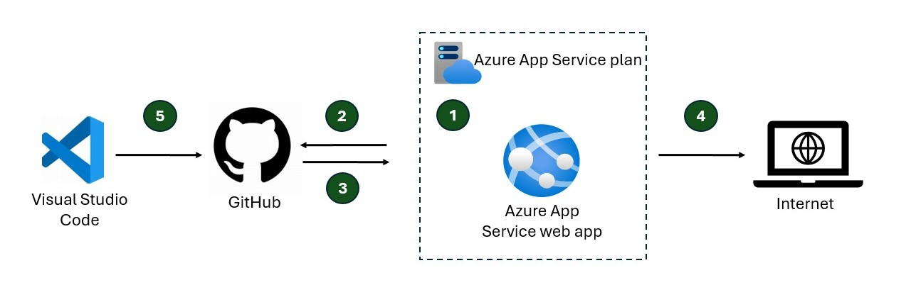

# Readme

A flask app that takes docx files and converts them to markdown. AI-assisted code development. 

Fork and clone this repo as a prerequsite.

## Deploy to Azure App Service



1. Create a web app in Azure App Service. Use Python 3.12 runtime. Start with a Free App Service Plan.
2. Connect GitHub organization to the web app in Azure App Service. With a Free App Service Plan, you have to connect GitHub to the web app after the deployment. In the Azure Portal, find you web app you created in step 1. Select "Deployment Center" on the left. In the Settings tab, enter the correct source control, organization, repository, and branch. Select "Add Workflow", and Azure App Service automatically creates a workflow yaml file and adds it to your repository.
3. Using the yaml file, GitHub Actions automatically deploys the code to the web app. In GitHub, you can track the build and deployment progress using the "Actions" tab at the top of the repo.
5. In the portal, find your "Default domain" and click the link.
6. Any code updates you commit and sync to GitHub automatically deploy to your web app.

## Local deployment steps

Create virtual environment

```python
python -m venv venv
```

Activate virtual environment

```python
.\venv\Scripts\Activate 
```

Install dependencies if needed

```python
# update pip
python.exe -m pip install --upgrade pip
```

```python
pip install flask
pip install docx2md
pip install mammoth
pip install flask python-docx mammoth
pip install html2text
pip install python-docx tabulate
```

Updated requirements txt file

```python
pip freeze > requirements.txt
```

Build and run app

```python
python app.py
```

In browser, paste the following url

```python
http://localhost:5000/
```

Stop web app

`Ctrl` + `C`

